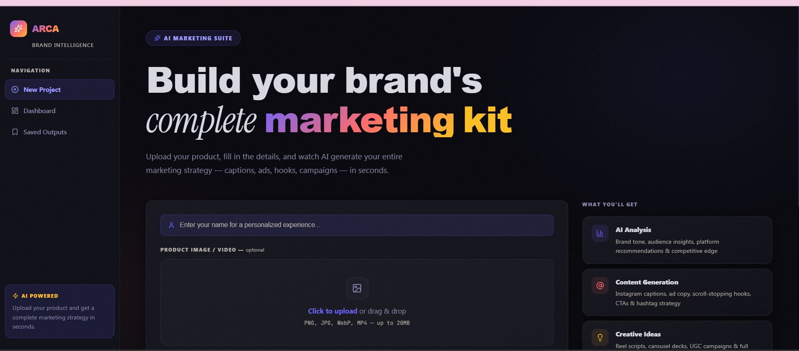
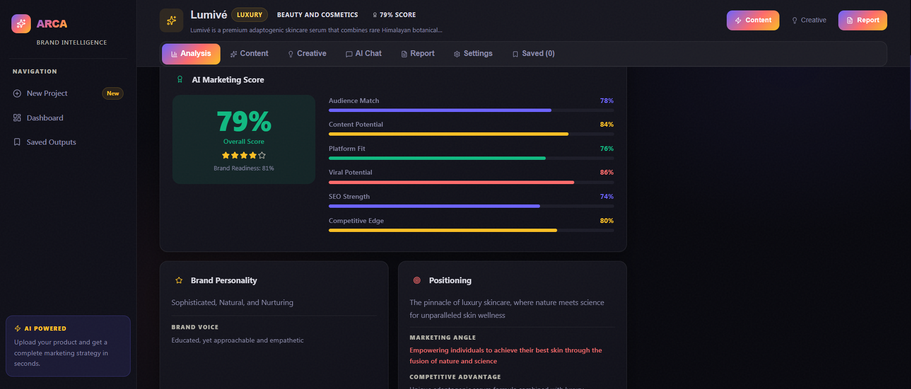
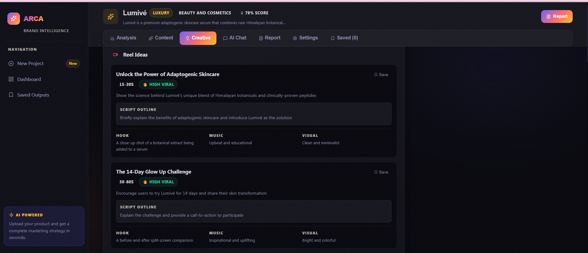
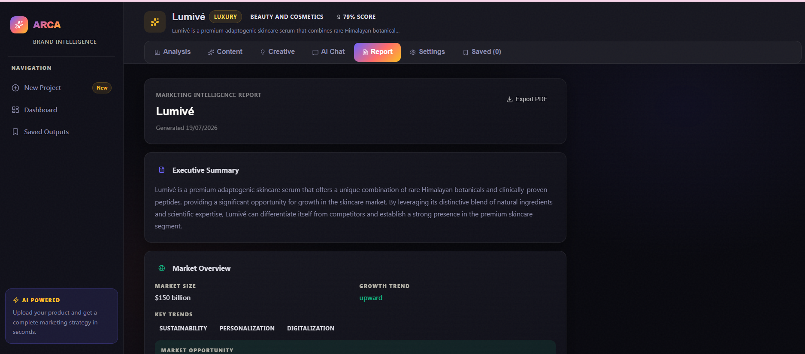

# ARCA — AI Marketing Platform

> **Turn your product into a complete marketing strategy in seconds.**

ARCA is an AI-powered marketing intelligence platform that extracts your brand DNA and generates captions, ads, hooks, campaigns, reports, and more — all from a single product upload.

🌐 **Live Demo:** [https://arca-frontend-xxxx.onrender.com](https://arca-frontend-spqm.onrender.com)  

---

## Screenshots

### 🏠 Homepage


### 📊 AI Analysis — Smart Brand Profile + Marketing Score


### ✍️ Content Generation


### 📄 Marketing Report


---

## Features

### 🔍 Smart Brand Extraction
Upload your product image and description — AI automatically extracts:
- Product category & industry
- Suggested brand colors
- Packaging style analysis
- Luxury Score (1–10)
- SWOT Analysis with strategic implications
- Premium level (Mass Market → Luxury)
- Unique Selling Proposition (USP)
- Brand keywords & top competitors
- Breakthrough campaign idea

### 📊 AI Marketing Score
8-dimension brand readiness score — unique to every product:

| Dimension | What it measures |
|---|---|
| Overall Score | Weighted average of all dimensions |
| Brand Readiness | How ready the brand is to go to market |
| Audience Match | How well-defined and reachable the audience is |
| Content Potential | How much quality content can be created |
| Platform Fit | How naturally the product fits social platforms |
| Viral Potential | Likelihood of content going viral |
| SEO Strength | Strength of search keywords |
| Competitive Edge | Differentiation from competitors |

### ✍️ Rich Content Generation
From one click, get:
- Instagram captions in **3 versions** (Short, Long, Emoji) per style
- Email subject lines (4 types — Curiosity, Urgency, Benefit, Personalized)
- 6 scroll-stopping hooks (Curiosity, Problem, Social Proof, Shock, Story, Controversy)
- Ad copy for Facebook, Google, LinkedIn, YouTube
- CTA suggestions with urgency levels
- 5-category hashtag strategy (Primary, Niche, Trending, Branded, Community)

### 💡 Creative Strategy
- Reel ideas with scripts, music vibe & viral potential scoring
- Carousel breakdowns with slide-by-slide content
- Full campaign strategies with KPIs & budget tiers
- UGC campaign ideas with mechanic & incentive
- 4-week content calendar with themes & content mix

### 🤖 AI Chat Assistant
Context-aware brand assistant — knows your full brand profile:
- *"Give me 5 campaign ideas"*
- *"Rewrite this caption for LinkedIn"*
- *"Compare with my competitors"*
- *"What should I post this week?"*
- *"Generate an email for this product"*

### 📄 Marketing Report
Full marketing intelligence report:
- Executive Summary
- Market Overview & Growth Trends
- Competitor Analysis table
- SWOT Analysis with strategic implications
- 3-month marketing strategy
- Budget allocation with visual bars
- KPIs to track
- Top 3 priority recommendations
- Export as PDF


### 🏠 Smart Dashboard
- Personalized greeting with your name
- 6-stat overview (projects, content kits, reports, saved outputs, avg score)
- Project cards with marketing score badges
- All saved outputs in one place

---

## Tech Stack

| Layer | Technology |
|---|---|
| Frontend | Next.js 15 (App Router) + TypeScript |
| Styling | Tailwind CSS + Custom CSS Design System |
| Backend | Node.js + Express |
| AI | Groq API — Llama 3.3 |
| Database | PostgreSQL|
| File Handling | Multer |
| Deployment | Render |

---

## AI Workflow

```
User uploads product (image + brand details)
              ↓
POST /api/analyze
  → Smart Brand Extraction
    (colors, USP, keywords, luxury score, competitors, packaging)
  → Deep Brand Analysis
    (SWOT, customer persona, marketing funnel, brand positioning)
  → Content Strategy
    (pillars, themes, content mix, best posting times)
  → AI Marketing Score (8 dimensions, product-specific)
  → Full brand profile stored in PostgreSQL
              ↓
All modules use stored brand profile as context:
              ↓
POST /api/generate-content
  → Instagram captions (3 versions each)
  → Email subject lines, hooks, ad copy, CTAs, hashtags

POST /api/generate-creative
  → Reel ideas with scripts
  → Carousel breakdowns
  → Campaign strategies with KPIs
  → UGC ideas + content calendar

POST /api/generate-report
  → Full marketing intelligence report
  → SWOT, competitor analysis, 3-month strategy, KPIs

POST /api/chat
  → Brand-aware AI conversation using full project context
```

---

## Setup & Run Locally


### 1. Clone the repo
```bash
git clone https://github.com/rupalirudresh-18/Arca.git
cd Arca
```

### 2. Setup Backend
```bash
cd backend
cp .env.example .env
```

Edit `backend/.env`:
```env
GROQ_API_KEY=your_groq_api_key_here
DATABASE_URL=your_postgresql_connection_string
PORT=5000
```

```bash
npm install
npm start
# ✓ Database ready
# 🚀 Arca backend running on http://localhost:5000
```

### 3. Setup Frontend
```bash
cd frontend
cp .env.example .env.local
```

Edit `frontend/.env.local`:
```env
NEXT_PUBLIC_API_URL=http://localhost:5000/api
```

```bash
npm install
npm run dev
# Open http://localhost:3000
```

---


## Project Structure

```
Arca/
├── backend/
│   ├── server.js          # Express API + Groq AI + PostgreSQL
│   ├── package.json
│   ├── .env.example
│   └── uploads/           # Product images
│
├── frontend/
│   ├── app/
│   │   ├── page.tsx                  # Homepage
│   │   ├── dashboard/page.tsx        # Dashboard
│   │   ├── project/[id]/page.tsx     # Project detail (7 tabs)
│   │   ├── components/Sidebar.tsx    # Navigation
│   │   └── globals.css               # Design system
│   ├── lib/
│   │   └── api.ts                    # API layer
│   └── next.config.ts
│
└── README.md
```

---

## Future Improvements

- [ ] AI-generated visual poster & mockup templates
- [ ] Multi-language content generation (Hindi, Tamil, etc.)
- [ ] Live competitor intelligence tracking
- [ ] Team collaboration & shared brand workspaces
- [ ] Mobile app (React Native)

---


## Author

**Rupali**
---

